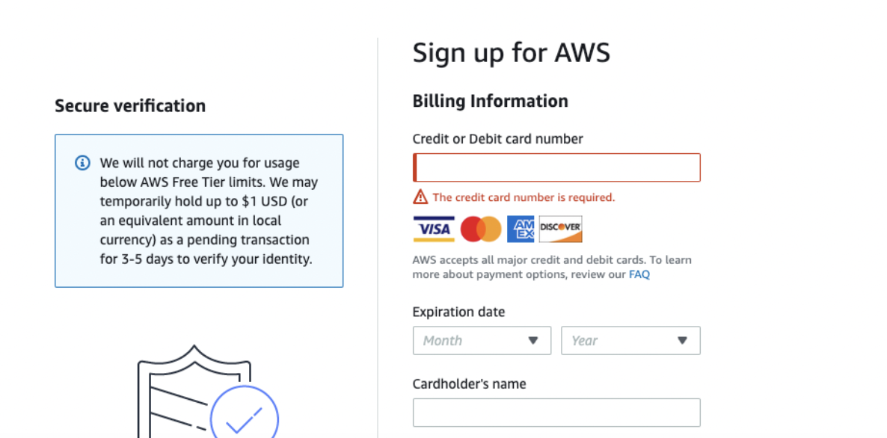
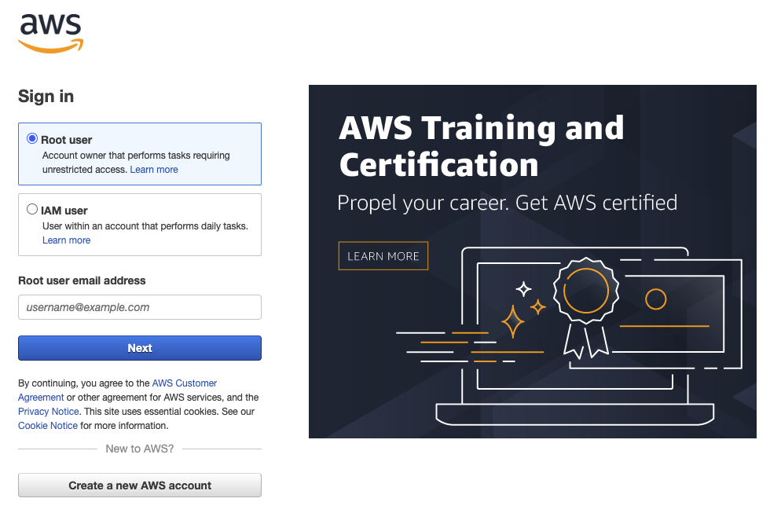
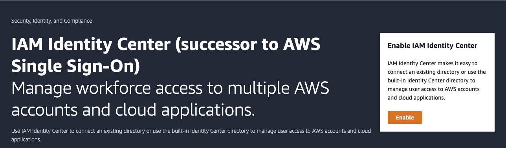
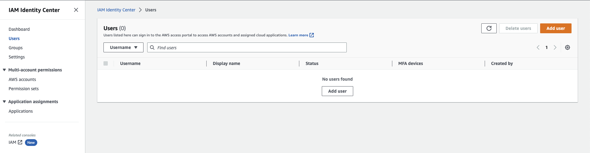
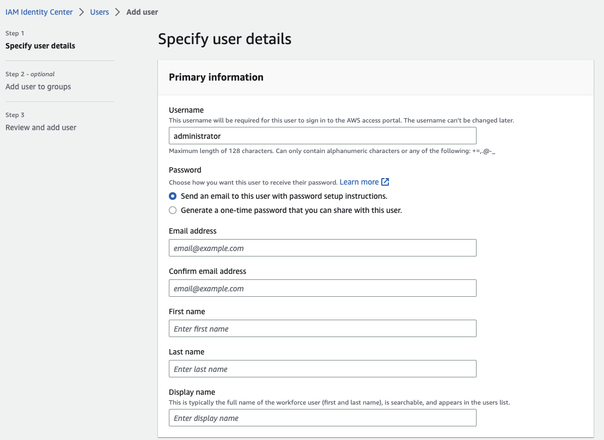

# Account Security

> This section goes over some AWS account-related items that we haven't yet covered in depth. ***We want you to take care of these security-related items now***, but rest assured, the AWS training **WILL** cover these items in more detail!

# Create Account

First of all, you’ll need to create an AWS account. 

1. Go to the [Sign Up page](https://portal.aws.amazon.com/billing/signup) and create an account. **You will be asked to use a valid debit or credit card which may place a temporary hold of #1 USD to verify your identify. Nothing will be charged so long as you remain in the free tier (see Billing Alarms to ensure you stay in the free tier).** 

## Activate Multi-Factor Authentication

Next, follow the steps in this guide to [Activate MFA on the AWS account root user](https://docs.aws.amazon.com/IAM/latest/UserGuide/id_credentials_mfa_enable_virtual.html#enable-virt-mfa-for-root).

## Create New IAM User

AWS best practice states to not use the AWS account root user for any task where it's not required. Thus, we'll need to create an administrator account.

### Creating a New IAM User with Administrator Access

> These directions can also be found on AWS at [new IAM user with Administrator Access]( https://docs.aws.amazon.com/IAM/latest/UserGuide/getting-started_create-admin-group.html)

1. Sign in to the [AWS Management Console](https://console.aws.amazon.com/) as the account owner by choosing **Root user** and entering your AWS account email address. On the next page, enter your password.
    - The root user is the account owner

2. Open the [IAM Identity Center console](https://console.aws.amazon.com/singlesignon)
3. Under **Enable IAM Identity Center**, choose **Enable**.

4. If you haven't set up an organization, you must choose whether to have AWS create one for you. Choose **Create AWS organization** to complete this process.
5. In the IAM Identity Center, select Users and then Add User. 

6. Finally, give the user a username of "Administrator" and assign it your email address. You will get an email link to sign in as this administrator.

7. Finish setting up the administrator user by using the link sent to your email.
8. From now on, [only sign in with this new IAM user](https://docs.aws.amazon.com/IAM/latest/UserGuide/getting-started_how-users-sign-in.html), ***not*** as the root user. The sign in URL can be found in your IAM Dashboard:

## Knowledge Check ✅
1. Check off the items as you complete them!
    - Create Account
    - Activate Multi-Factor Authentication on the AWS account root user
    - Create New IAM User, and only use this new user to log in to the console

Congratulations! If you've made it this far, you have taken the first step in securing your AWS account!