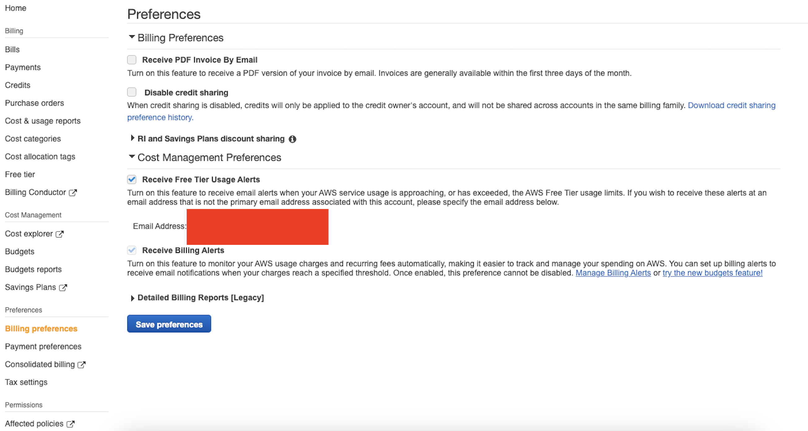
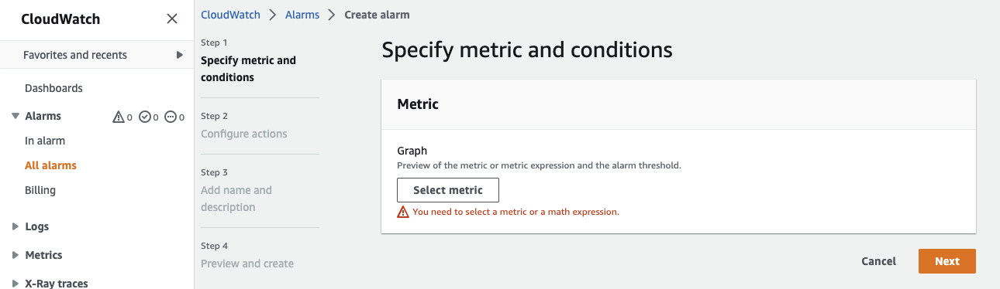
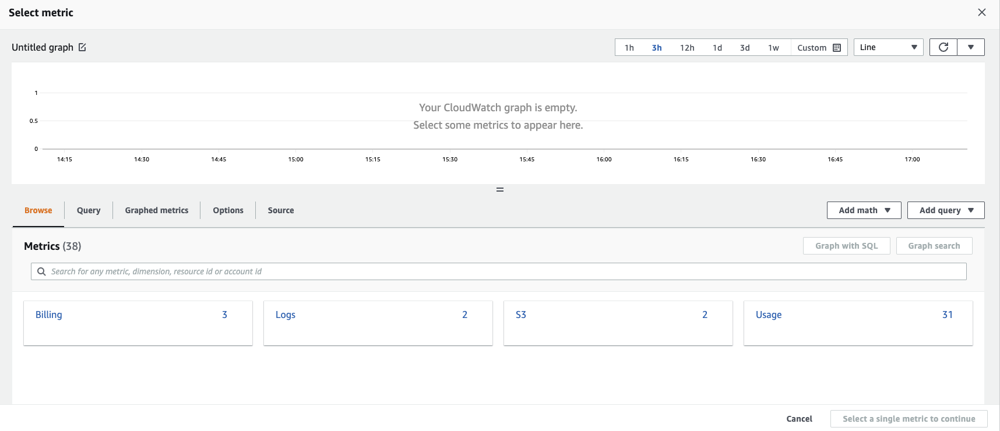
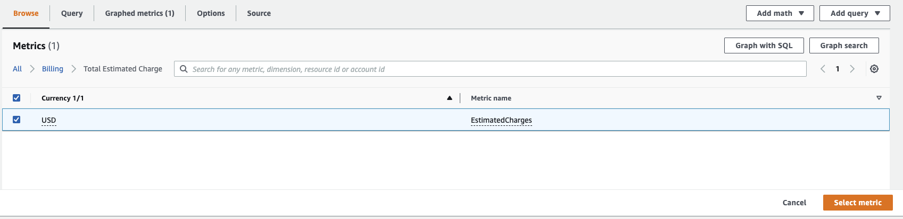
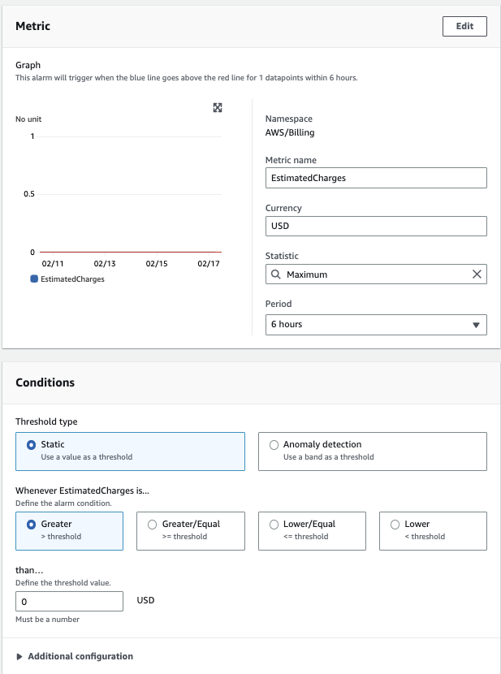
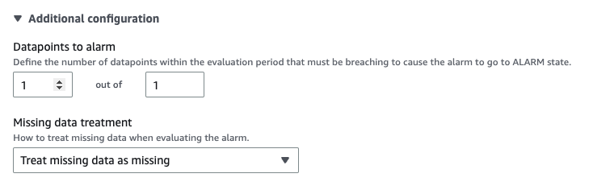
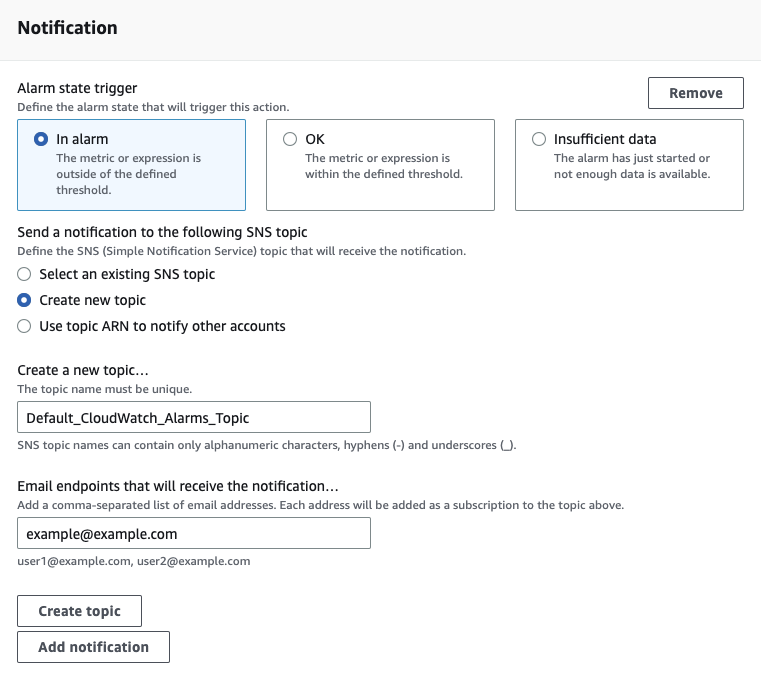
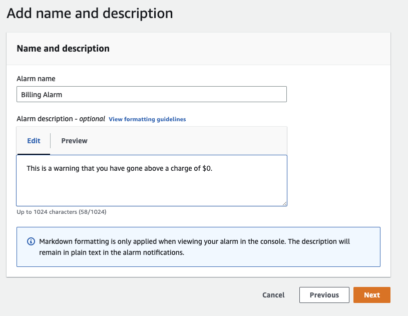
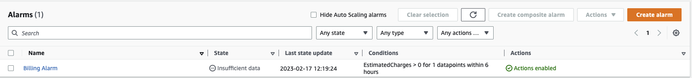

# Billing Alarms 🚨

One of the greatest features of AWS is its elasticity and extensibility. Since there are virtually no limits to what you can do with AWS, there are also virtually no limits to what you can ***spend***. 😱 This should put much fear in your heart (and pocketbook! 💴 ).

Of course, we will help you to use only the free services on AWS, but the free tier has limits, and since it's extremely easy to rack up a 6-figure monthly bill in AWS without knowing it, it's ***imperative*** to set up a billing alarm that will email you whenever your bill goes over a set amount.

## Create a Billing Alarm

> What amount should you set it to? That's up to how much you're OK with spending on AWS, but we would suggest $0 as you are just starting to learn how to use AWS (you can always go back and adjust later!). An alert set for $0 will not impact anything you need to do for this module!

The directions below are [taken from this documentation](https://docs.aws.amazon.com/AmazonCloudWatch/latest/monitoring/monitor_estimated_charges_with_cloudwatch.html).

### Enable Billing Alerts
1. Open the AWS Billing console at https://console.aws.amazon.com/billing/.
2. In the navigation pane, choose **Billing Preferences**.
3. Choose **Receive Billing Alerts**.

4. Choose **Save preferences**.

### Create a Billing Alarm

> Before you create a billing alarm, you must set your Region to US East (N. Virginia).

1. Open the CloudWatch console at https://console.aws.amazon.com/cloudwatch/.
2. In the navigation pane, choose **Alarms**, and then choose **All alarms**.
3. Choose **Create alarm**.
4. Choose **Select metric**. In **Browse**, choose **Billing**, and then choose **Total Estimated Charge**.

5. Select the box for the **EstimatedCharges** metric, and then choose **Select metric**.

6. For **Statistic**, choose **Maximum**.
7. For **Period**, choose **6 hours**.
8. For **Threshold type**, choose **Static**.
9. For **Whenever EstimatedCharges is . . .**, choose **Greater**.
10. For **than . . .**, define a threshold value that triggers your alarm (for example, `10` USD if you want your limit to $10). The example below is set to 0.

11. In **Additional Configuration**, do the following:
    - For **Datapoints to alarm**, specify **1 out of 1**.
    - For **Missing data treatment**, choose **Treat missing data as missing**.

12. Choose **Next**.
13. Under **Notification**, specify an Amazon SNS topic to be notified when your alarm is in the `ALARM` state. You can select an existing Amazon SNS topic, create a new Amazon SNS topic, or use a topic ARN to notify other account. When topic and email have been added select **Create Topic**.

14. Choose **Next**.
15. Under **Name and description**, enter a name for your alarm.
    - (Optional) Enter a description of your alarm.

16. Under **Preview and create**, make sure that your configuration is correct, and then choose Create alarm.
17. Verify the alarm by clicking the link in the email that was sent to your email.
18. Congratulations you have enabled a billing alarm!

## Knowledge Check ✅

1. Check off the items as you complete them!
    - Enable Billing Alerts
    - Create a Billing Alarm