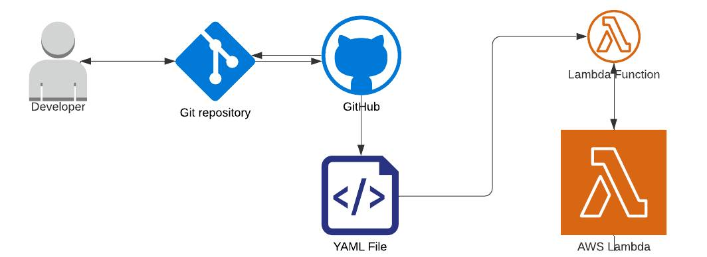

# Infrastructure As Code

Congratulations on a job well done! You have just completed what only some developers have: Full-circle deployment of a serverless function that auto-updates on pushes via a Continuous Deployment pipeline, via programmatic access to AWS via a managed IAM user.

## Review

In the AWS Skill Builder lessons, you learned about [Infrastructure As Code](https://docs.aws.amazon.com/whitepapers/latest/introduction-devops-aws/infrastructure-as-code.html), which is controlling infrastructure and deployments via code that is managed via a source control system (git) and that logs a history of code development, changes, and bug fixes.

What you just completed is just that. 
- You wrote the code for the deployment on your local machine
- The code was managed via git
- The permissions were managed via the same code.
- New versions of your application and infrastructure are tracked.
- If anything went wrong, you were able to debug and fix it via further edits and pushes to the repository.

As discussed previously, this history and rigor of application development provide clarity, stability and reliability.

There are so many more possibilities with AWS Cloud technologies. We will explore some of these in the next project! The important thing is to stay curious, and explore more of what AWS and other cloud providers have to offer.