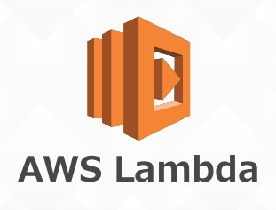
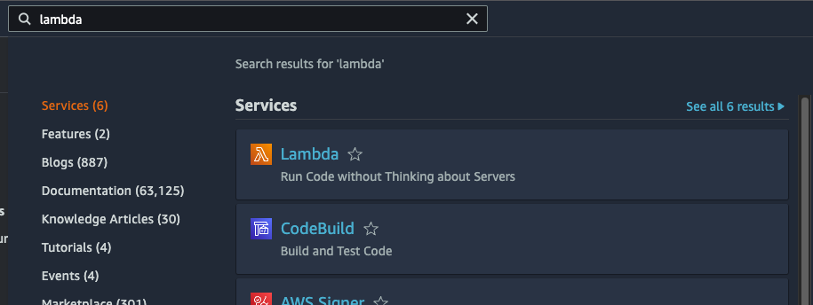
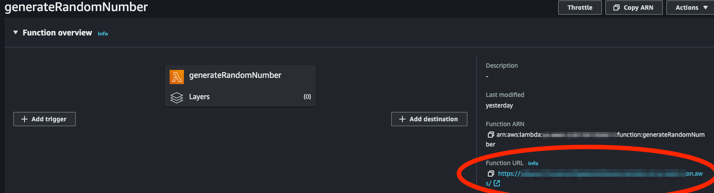

# Lambda Functions

Today, we're going to create our first Lambda ƛ function! 🥳

> The simplest way to learn, test, edit and deploy AWS Lambda is to use the AWS Console. That's what we'll do today. Later on, we'll get into more complex and controlled methods of writing and deploying functions.

## First Lambda Function

1. [Log in to the AWS Console](https://console.aws.amazon.com/console/home).

> At the beginning of this course, you created a new [IAM user](https://us-east-1.console.aws.amazon.com/iamv2/home) with the `AdministratorAccess` managed policy. **Log into the AWS Console using that IAM user's credentials (NOT your root user credentials)**.

2. In the search bar at the top, search for Lambda and select it to go to the lambda dashboard. Click on [Create Function](https://us-west-2.console.aws.amazon.com/lambda/home?region=us-west-2#/create/function).

### Create Function

1. For **Function Name**, write `generateRandomNumber`. For **Runtime**, choose `Node.js 16.x`
2. Under **Advanced Settings**, select "Enable Function URL"
3. For **Auth type**, select "NONE". This enables the URL to be publicly accessible.
4. Optionally, select "Configure cross-origin resource sharing (CORS)", if you want to be able to hit this endpoint from a front end application (like one built in React). For testing purposes, we won't be calling the url from a front-end application.

Your function is now created! 💪 

### Test It Out

On the next page, in the Function Overview panel, click the **Function URL** link to see the response your function currently returns. If you see the text, "Hello from Lambda!", you have completed the steps correctly.

