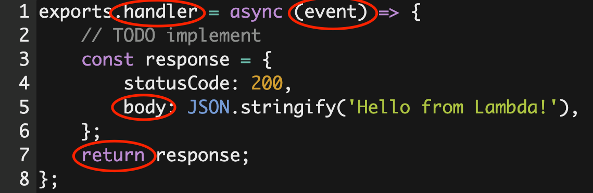

# Random Number Generator

> Since we haven't learned debugging Lambda functions yet, it might be easiest to run this code in a local file or a REPL like repl.it until you have it working how you want, then paste into the lambda function.

**TASK**: The `exports.handler` should generate a random integer between 1 and 10, inclusive of both.

## Random Numbers and JavaScript Review

### Generating Random Numbers

- [`Math.random()`](https://developer.mozilla.org/en-US/docs/Web/JavaScript/Reference/Global_Objects/Math/random) will generate a random number from 0 to just under 1.

### Generating A Range of Random Numbers

- `Math.random()` will give us decimals like 0.25, 0.37, or even 0. We don't want zero, and we want it to be between 1 and 10.
- So, we need to multiply our random number by 10 to make sure we don't always get something under 1! 
    ```javascript
    Math.random() * 10
    ```

### Generating Random Whole Numbers
- The previous step generates a random decimal value in a given range.
- [`Math.ceil()`](https://developer.mozilla.org/en-US/docs/Web/JavaScript/Reference/Global_Objects/Math/ceil) will round up to the nearest integer! This expression will resolve to a random number from 1 to 10.
    ```javascript
    Math.ceil(Math.random() * 10)
    ```

## Syntax Review

OK, now it's time to implement this in our function. You should be a bit familiar with the syntax from the lessons on Serverless and Lambda, but here is a recap:

Back to our Lambda function. In the "Code Source", look at the code of `index.js`

1. There is no "server" like Express. This is a function that gets invoked when someone visits the Function URL.
2. `exports.handler` is the function that gets invoked when an event triggers the Lambda.
3. `event`, the first parameter in the function, includes data and metadata about the event. For an API call, this is where we will receive data like query string parameters and the body of the request.
4. The `body` property of the object that is `return`ed from the function is in the response to the client that made the request.



Now that we've refreshed our memory, let's get our super-awesome random number code deployed to Lambda! 👍
- In the `response` object that gets `return`ed, replace the `JSON.stringify('Hello from Lambda!')` with our random number expression from above.
- Click "Deploy"
- Visit the Function URL again, and you should see a random number from 1 to 10 as the response!