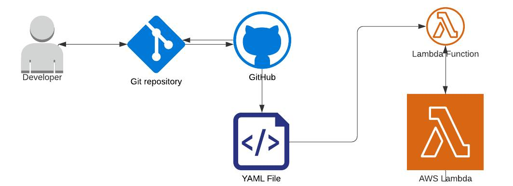
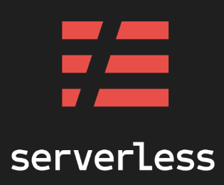

# Serverless Framework Setup



In this exercise, we'll build an email service using a Lambda Function, and deploy it via the Serverless Framework using GitHub Actions. Though most of our time will be spent in the code editor and configuring permissions, our service will use all of these AWS technologies
- Lambda (serverless compute functions, of course!)
- SES (for the email)
- IAM (permissions)
- CloudWatch (logging)
- S3 (storage)
- CloudFormation (the stack built by Serverless)

In addition, we'll use our previously-acquired skills with these GitHub technologies
- Actions (Continuous Deployment)
- Repository Secrets

> Working in serverless is a big shift in our frame of mind, and debugging can be difficult in a new environment. Remember, Google and StackOverflow are your friends, but also are the AWS docs! Read error messages thoroughly and scour the AWS documentation for answers.



## Setup

> If you don't have sudo/admin access on your laptop: [Fork and clone this repo](https://github.com/MultiverseLearningProducts/email-service).

1. Go to https://github.com/new and create an empty repository called email-service
2. Next, on your local machine, do the following:
    - Install the serverless framework globally.
        ```Shell
        npm install -g serverless
        ```
    - Clone your repository
        ```Shell
        git clone your-repo-url
        ```
    - `cd` into the directory
        ```Shell
        cd email-service
        ```
    - Create a new project via the serverless framework (DO NOT run `npm init -y` as we have in the past).
        ```Shell
        serverless create --template aws-nodejs
        ```
3. That last step generates a few files, but most importantly, these three we'll be editing later on:
    - `.github/workflows/deploy-lambda.yml` - The workflow configuration file for GitHub Actions to run the deployment steps
    - `serverless.yml` - The configuration file that tells Serverless what/where to work on AWS.
    - `handler.js` - The function to execute. The Serverless Framework uses `module.exports.hello` instead of `module.exports`, but we will change this.