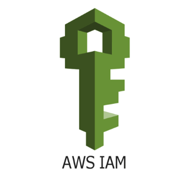
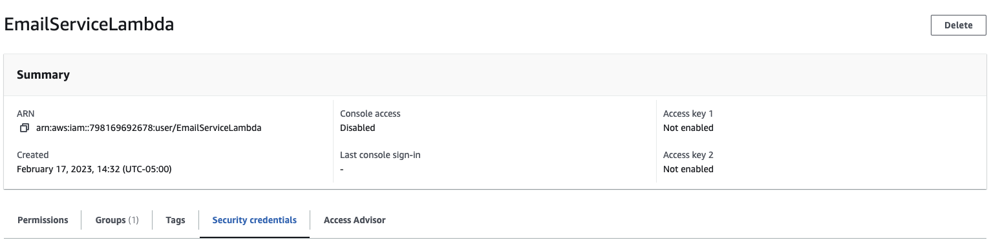
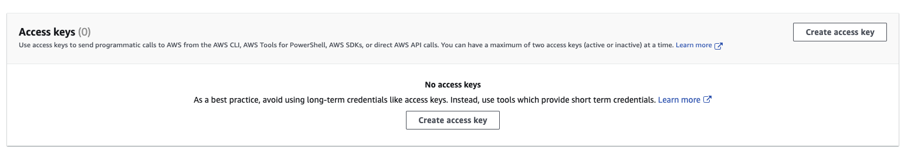
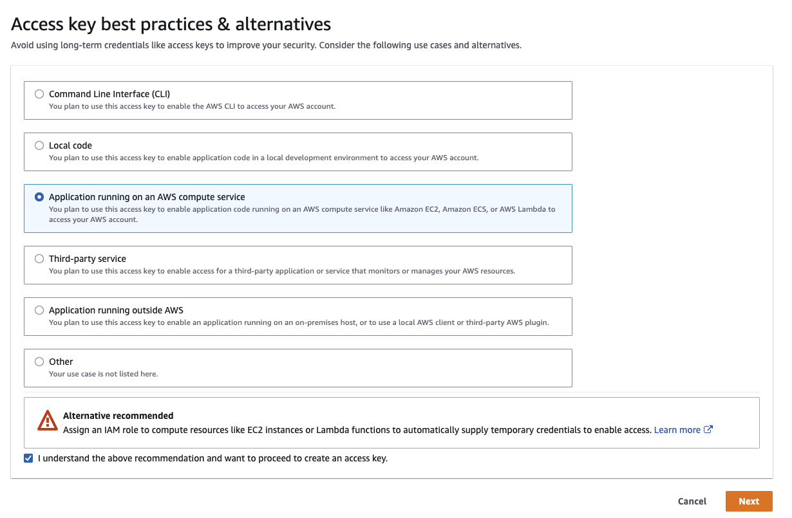
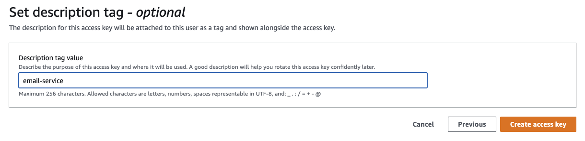
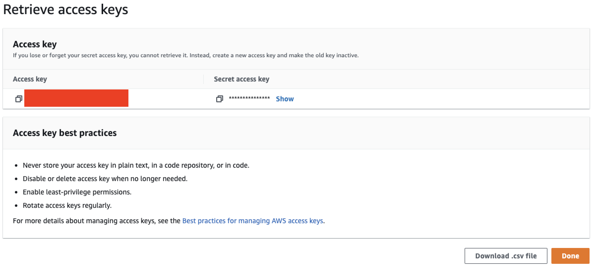

# IAM Permissions and GitHub Secrets

Since we'll be deploying a lambda function programmatically from GitHub Actions, we'll need to enable permissions for this! We'll need to:
1. Create an IAM group with the necessary permissions
2. Add an IAM User to that group
3. Add the secrets in the GitHub repo.

## AWS IAM Permissions

### AWS IAM Group

**In the AWS console:**
1. Search for and navigate to IAM.
2. Click "User groups"
3. Name the group `GitHubActionsLambda`
4. Attach following permissions policies:
    - AmazonAPIGatewayAdministrator
    - IAMFullAccess
    - CloudWatchFullAccess
    - AmazonS3FullAccess
    - AWSCloudFormationFullAccess
    - AWSLambda_FullAccess
6. Click "Create Group"

### AWS IAM User

**In AWS IAM (open from last step):**

1. On the left hand menu, click "Users", then click "Add Users"
2. Name the user "EmailServiceLambda" (this could be anything, but for reference in the following steps, we'll keep the name the same)
3. Add the User to your `GitHubActionsLamda` group.
4. Click "Create User"
5. Select the newly created user from the dashboard.
6. Click on **Security Credentials**

7. Scroll down to **Access keys** and select Create access key 

8. Select **Application running** on an **AWS compute service** and check the I understand box.

9. Set a description tag value.

10. Leave the window open for the next step below. **This is the one and only time you'll be able to view the id and secret, so don't close the window!**

## GitHub

1. Go to the repository you have created (it's likely still an empty repo)
2. Go to the Settings tab → click "**Secrets and Variables**" → Then select "**Actions**".
3. Click "New Repository Secret"
    - Name: AWS_ACCESS_KEY_ID
    - Secret: (the access key ID from the IAM User you created above)
4. Click "Add secret" and do the same for the Secret Access Key:
    - Name: AWS_SECRET_ACCESS_KEY
    - Secret: (the Secret access key from the IAM User created above)

Now your repo should have all the permissions necessary for Serverless to deploy to Lambda! 🚀