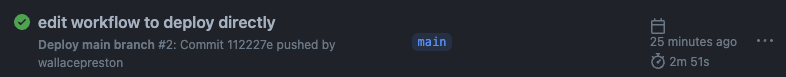

# Deployment From GitHub Actions 


This is the exciting part! We'll get to see our GitHub Actions workflow do magic via the Serverless framework!

## Enabling GitHub Actions

**In `serverless.yml`:**

1. Update the `runtime` to `nodejs16.x`, the latest node version AWS Lambda supports, as of the writing of this workshop
2. Under `provider:`, uncomment the line with the `region: us-east-1` and set it to whichever region you would like to use. For example, if you live in California, you typically use Oregon (`us-west-2`).
3. Change the function name under `functions` from `hello` to `send-email` and the `handler` to `handler.sendEmail`
4. Under `handler`, at its same tab indentation (sibling of `handler`, child of `send-email`), add `url: true` which [enables the function url for the lambda](https://www.serverless.com/blog/aws-lambda-function-urls-with-serverless-framework).
5. Optionally, remove the comments to clean things up
6. When you're finished, the file should look like this:

```yaml
service: email-service
frameworkVersion: '3'

provider:
  name: aws
  runtime: nodejs16.x
  region: us-west-2

functions:
  send-email:
    handler: handler.sendEmail
    url: true
```

**In `handler.js`:**
1. Rename `module.exports.hello` to be `module.exports.sendEmail` so that it matches the yml file we edited above.
2. If it doesn't already exist, create a `.github/workflows` directory
3. Add a file in the `.github/workflows` directory.
4. The name isn't super important, but a good name would be `deploy-lambda.yml`. 
    - There are a few reserved names that you can't use. One example: Don't call it `deploy.yml` because you'll get gross linting issues.  If you're curious, you can [learn why here](https://github.com/redhat-developer/vscode-yaml/issues/640).
5. Copy the most recent code from the "Usage" section of the [official serverless github-action workflow](https://github.com/serverless/github-action#usage) and paste it into your new yml file.  It should be code starting with something like this…

```yaml
name: Deploy master branch

on:
  push:
    branches:
    # etc...
```

6. Make 3 changes to the copied code:
    - Change `master` to `main` (in the `name` and `branches`), so that this triggers when pushing to the main branch.
    - At bottom, remove the line with `SERVERLESS_ACCESS_KEY` and uncomment the last 2 lines to use the two GitHub Secrets we added previously, `AWS_ACCESS_KEY_ID` and `AWS_SECRET_ACCESS_KEY`.
    - Remove the line with `- run: npm ci`, since we don't have a `package.lock` file in this project.
7. Run `git add -A` to add everything to the staging area
8. Then commit and push to the remote `commit -m "edit workflow to deploy directly"` and `git push`. 

**On GitHub:**
Let's watch the pipeline run!
1. Go to your repository
2. Click the "Actions" tab
3. Click on your workflow run (its title is the same as the commit message you made above)
4. Watch the workflow run in its entirety.  The steps up until now should take care of all issues, but if there are errors, read them and debug.  You may have to re-read some of the steps above to remedy the problem.
5. If all runs correctly, you should see a green checkmark.



6. Click through to the `serverless-deploy` step.


7. There, you should see a line displaying `endpoint: your-really-long-lambda-function-url-here`. Click it.


If the response JSON contains a message property "Go Serverless v1.0! Your function executed successfully!", you have successfully deployed via serverless and github actions.

Then let's go take a look in AWS!

### View AWS Lambda

In AWS, go to [Lambda](https://us-west-2.console.aws.amazon.com/lambda/home). Make sure you're in the region written in the `serverless.yml` file

1. You should see a new function listed, called `email-service-dev-send-email`. Amazing! 🤯 The function was created programmatically! 😮
2. You can click into it and view the code that was deployed.
3. Click "Monitor" → "Logs" → "View Logs in CloudWatch" to view your log stream with the list of all requests

Take a moment to bask in your own glory. 🤩 🤴 ☀️ You just deployed an AWS Lambda function programmatically by adding Infrastructure-as-code to your project.