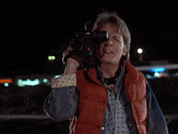

# Presentation Creation

Once our project is complete, it's time to create our presentations and film the final video! Remember, your presentation needs to include ***at a minimum***:
1. App Overview (walk through using the app or calling the APIs, and what the response looks like).
2. A stack trace of how the app works, including diagrams of the data flow.
3. Project management, including your deployment/CI-CD system.

## Presentation Creation 🧑‍💻

As we've done before, the presentation needs to be a short (less than 5 minutes) pre-recorded talk/presentation on demonstrating and explaining your app. Using Google Slides greatly helps structure what you want to say and reduce the amount of video editing you need to do. 

The video below provides [some tips and tricks](https://docs.google.com/presentation/d/13AlOXYXeop1BOpw6fTrpnjreh8Kr1G3OuVr7owjrysI/edit#slide=id.g1869e27791e_0_0) for creating an effective presentation on your topic.

>[Cloud Elective Presentations Video](https://www.loom.com/share/e6002ab581304f0fa5219b1be133392f)

**TASK**: Share your slides in the space below. To ensure everyone can access the slides do the following:
1. Click "Share"
2. Under "General Access" ensure that "Anyone with the Link" is a "Viewer".
3. Copy the link into the space below
4. Share the link to your presentation here.